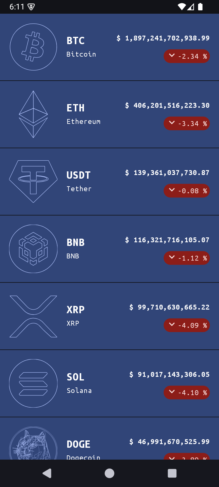
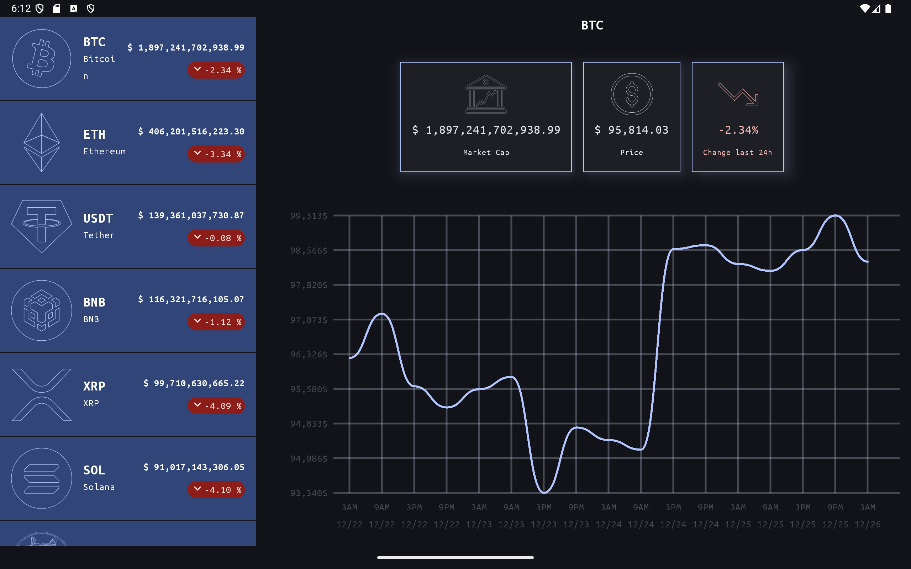

# CryptoTracker

**CryptoTracker** is an Android application for tracking cryptocurrency prices in real time, developed with a focus on good architectural practices. This project was inspired and built as part of the course **"The Best Practice Guide to Android Architecture"** by [Philipp Lackner](https://www.youtube.com/@PhilippLackner).

## 🌟 **Project Highlights**

- **Real-time tracking:** See changes in the cryptocurrency market with updated prices.
- **Efficient Research:** Quickly find the desired cryptocurrency.
- **Dark Mode:** Light and dark theme for a more personalized experience.
- **Detailed Visualization**: Specific information about each cryptocurrency.

## 🔧 **Technologies Used**

This project uses modern tools and standards of the Android ecosystem:

- **Jetpack Compose:** For a declarative and responsive UI.
- **MVVM Architecture:** Separating responsibilities between layers.
- **Kotlin Coroutines & Flow:** Asynchronous data and event management.
- **Ktor:** Integration with REST APIs to fetch data in real-time.
- **Koin:** Dependency injection.
- **Jetpack Navigation:** Safe and efficient navigation.
- **Material Design 3:** For a modern and accessible design.

## 🔄 **Project Architecture**

O CryptoTracker was developed following a clean architecture approach:

- **Presentation Layer:** Managed by `ViewModels` and `State` with Compose.
- **Domain Layer:** Contains business rules.
- **Data Layer:** Manages data sources, such as APIs and local databases.

Data flow:

1. **UI** -> Triggers user events.
2. **ViewModel** -> Processes events and triggers use cases.
3. **Repositories** -> Integrate data sources (API).
4. **Response** -> Updates the user interface state.

## 🌐 **How ​​to Set Up the Project**

1. **Clone the repository:**
   ```bash
   git clone https://github.com/HarukaYamamoto0/CryptoTracker.git
   ```

2. **Open the project in Android Studio:** Make sure to use the latest version.

3. **Synchronize the project:** Wait for Gradle to download the dependencies.

4. **Execute the app:** Run on an emulator or physical device.

## 🎨 **App Images**

### Mobile


### Tablet


**Note:** Images may be added in the future for greater clarity.

## 🖋️ **What Did I Learn?**

During the development of this project, important concepts were consolidated:

- How to structure Android projects with **Clean Architecture**.
- Using **Jetpack Compose** to build declarative UIs.
- Integration of **Reactive Streams** with Kotlin **Flow** and ViewModel.
- Implementation of **dependency injection** with Koin.
- Improvements in handling states and side-effects in the interface.

## ✍️ **Contributions**

Contributions are welcome! If you have suggestions, ideas, or encounter problems, open an [issue](https://github.com/HarukaYamamoto0/CryptoTracker/issues) or send a [pull request](https://github.com/HarukaYamamoto0/CryptoTracker/pulls).

## 📚 **License**

This project is distributed under the MIT License. See the [LICENSE](LICENSE) file for more details.

